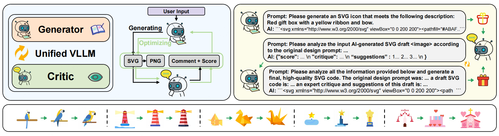
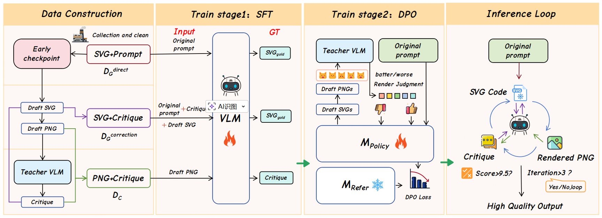
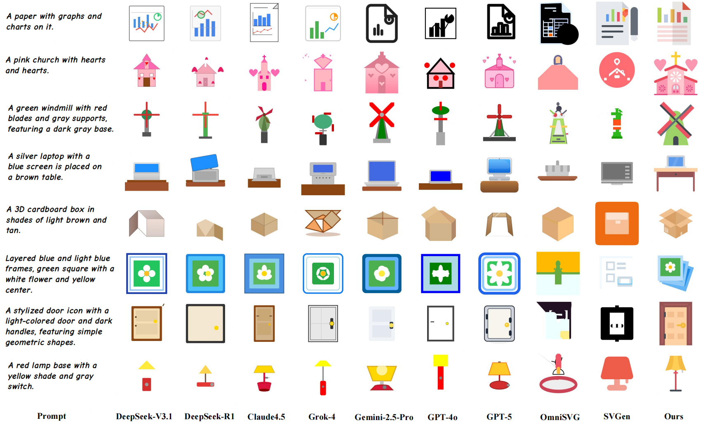
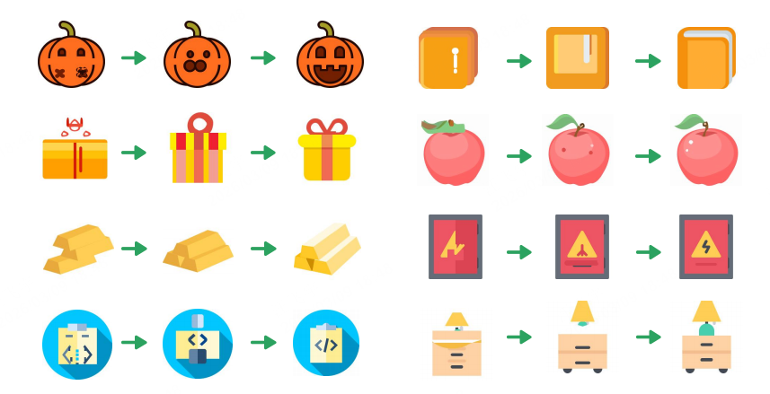

# IntroSVG: Learning from Rendering Feedback for Text-to-SVG Generation via an Introspective Generator–Critic Framework
## Accepted by CVPR 2026 🎉
<div align="center" style="line-height: 1.2;">

[](https://huggingface.co/datasets/gitcat404/IntroSVG-train)
[](https://huggingface.co/gitcat-404/SVGen-Qwen2.5-Coder-7B-Instruct)
</div>

## 1. Introduction
SVGen is an end-to-end model that generates high-quality SVG code from text. We fine-tuned a Large Language Model on our custom SVG-1M dataset using curriculum learning, Chain-of-Thought (CoT), and reinforcement learning.


## 2. Method

Our method is divided into the following stages.

### Data Construction

We synthesize a mixed dataset using an early checkpoint model and a Teacher VLM.
The dataset contains three types of data:

* **Direct generation**: D<sub>G</sub><sup>direct</sup>
* **Correction**: D<sub>G</sub><sup>correction</sup>
* **Critique**: D<sub>C</sub>

### Stage 1 — Supervised Fine-Tuning (SFT)

We train a **unified Vision-Language Model (VLM)** on the mixed dataset, enabling the model to simultaneously acquire:

* **SVG generation capability**
* **SVG critique capability**

### Stage 2 — Direct Preference Optimization (DPO)

A **Teacher VLM** evaluates generated **preference pairs**, which are used to optimize the model's **generation policy** M<sub>Policy</sub> through the **DPO loss**.

### Introspective Inference Loop

During inference, the final **single model** performs a closed-loop introspective process:

1. The model **generates an SVG**.
2. It then switches to a **Critic role**, rendering and evaluating the SVG output.
3. A **quality score** is assigned based on the critique.
4. If the score is unsatisfactory, the critique is used to guide the **next round of correction**.

This introspective loop allows the model to iteratively **generate → evaluate → refine** SVG outputs.

## 3. Dependencies
### 3.1 Clone the Repository
```bash
git clone https://github.com/gitcat-404/IntroSVG.git
cd IntroSVG
```
### 3.2 Create Conda Environment
```bash
conda create -n introsvg python=3.10 -y
conda activate introsvg
```
### 3.3 Dependencies for cairosvg
```bash
sudo apt update
sudo apt install libcairo2 libcairo2-dev
```
### 3.4 Python Dependencies
Training depends on the [LLaMA-Factory](https://github.com/hiyouga/LLaMA-Factory).
```bash
pip install torch==2.5.1+cu124 torchvision==0.20.0+cu124 --index-url https://download.pytorch.org/whl/cu124
pip install -r requirements.txt
cd LLaMA-Factory && pip install -e ".[torch,metrics]"
```
## 4. How to use
### 4.1 Download Model Weights
Please download the 🤗[IntroSVG-Qwen2.5-VL-7B](https://huggingface.co/gitcat404/IntroSVG-Qwen2.5-VL-7B) model and place it in the specified local directory.
```bash
pip install huggingface_hub
hf download gitcat404/IntroSVG-Qwen2.5-VL-7B --local-dir Models/IntroSVG-Qwen2.5-VL-7B
```
### 4.2 Interactive demo
An interactive web demo will be released soon.

### 4.3 Inference
To run inference, first prepare a CSV file containing prompts to be processed by the model. An example file is provided at:`example/test.csv`. Each row corresponds to a prompt for SVG generation.
#### Start the Inference Server
We use **lmdeploy** as the inference acceleration engine.
Example: deploying with 4 GPUs.
```bash
CUDA_VISIBLE_DEVICES=0,1,2,3 lmdeploy serve api_server "Models/IntroSVG-Qwen2.5-VL-7B" --tp 4 --server-port 23333
```
#### Run the Inference Script
```bash
python script.py \ 
  --MODEL_NAME Models/IntroSVG-Qwen2.5-VL-7B \
  --CSV_FILE example/test.csv \
  --OUTPUT_DIR "your_output_folder"
```

## 5.Train
All experiments were conducted on 8 × NVIDIA A800 GPUs.

Before training, please download: 🤗[Qwen2.5-VL-7B-Instruct](https://huggingface.co/Qwen/Qwen2.5-VL-7B-Instruct) and data from 🤗[SVG-1M-Json](https://huggingface.co/datasets/gitcat-404/SVG-1M-Json) and place the data in the `LLaMA-Factory/data` folder.
Training is executed using the LLaMA-Factory training pipeline.
```bash
sh train_sft.sh
```

## 6. Qualitative Results



